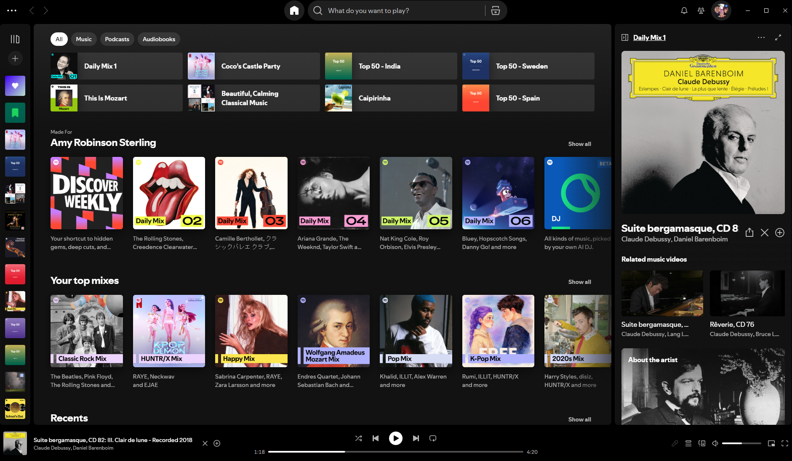
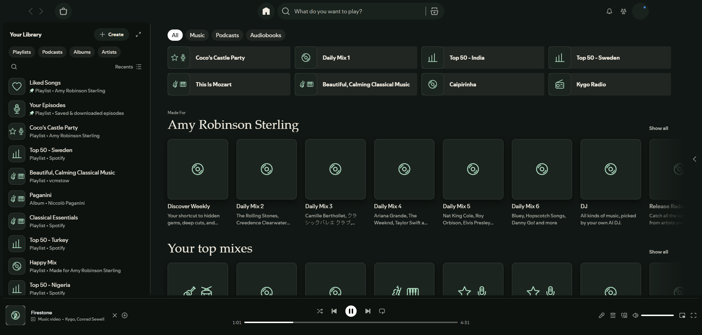

# Quiet / Listening Room

Text and icons for Spotify. Nocturne pairs deep green-black with ivory and jade; Linen uses warm paper and dark green. Serif headings and readable lists put the music first.

## Before and after

**Before — Spotify with album artwork**



**After — Quiet, with text-free genre and instrument icons and the sidebar closed**



These are real Windows Spotify screenshots. Recommendations, playback, and window size differ between captures.

The Now Playing sidebar can be closed using the visible sidebar button at its top left, and reopened from the player artwork/icon. The header has its own space above the video switch and track details. Music-video cards use a screen-and-play symbol; icons have no visible captions, while accessible labels remain available to screen readers.

## Windows

Use Spotify's **desktop edition** from [Spotify](https://www.spotify.com/download/windows/), and open it before installing. This installer does not uninstall or replace Spotify. The Microsoft Store edition is not supported by this package.

Extract the entire repository or Windows ZIP, open PowerShell in that folder, and run:

```powershell
powershell -NoProfile -ExecutionPolicy Bypass -File .\install-windows.ps1
```

Add `-Palette Linen` for the light palette. The execution-policy option applies only to this process.

## Mac

Install and open Spotify first. Extract the entire repository or Mac ZIP, then run:

```bash
bash /path/to/install-mac.command
```

Add `Linen` after the path for the light palette. Intel and Apple silicon downloads are selected automatically. If macOS cannot extract the zstd archive, install zstd and retry. Spotify's application folder must be writable by your account; a personal `~/Applications` installation avoids changing system permissions.

## What gets installed

The installers download the official **Spicetify 3.0.0-beta.14** runtime when absent and verify its pinned SHA-256 checksum before extraction. They save the existing configuration and Quiet module, configure desktop Spotify, copy the CSS theme and palettes, and run `apply`. Spotify restarts. The runtime backs up Spotify's original UI archive. Automatic background reapplication is disabled; rerun the installer after a Spotify update, checking the current Spicetify release compatibility first.

Runtime location on Windows: `%LOCALAPPDATA%\Spicetify\bin`. On Mac: `~/.config/spicetify/bin`. The installers print the configuration backup location. They preserve unrelated configuration keys and stop on errors. Existing different runtime versions are not silently replaced.

The theme includes original SVG line icons and a small local JavaScript module that reads visible titles to choose symbols. It makes no account/API requests, loads no remote assets, and does not intercept playback. Genre symbols are title-based cues, not detected instrumentation. Explicit instrument names can produce up to three icons; unknown titles use a neutral record. Images and videos are visually hidden in Spotify's music interface; this does not prevent media downloads or turn music videos into audio tracks. Native SVG controls remain visible. Login graphics are outside the artwork suppression rules.

## Restore stock Spotify

Windows PowerShell:

```powershell
& "$env:LOCALAPPDATA\Spicetify\bin\spicetify.exe" restore
```

Mac:

```bash
"$HOME/.config/spicetify/bin/spicetify" restore
```

To return to a previous Spicetify configuration, restore `config.toml` and the `quiet` module from the printed backup folder, then run that runtime's `apply`.

## Verification and limits — September 9, 2026

Windows desktop Spotify **1.2.99.317** with Spicetify **3.0.0-beta.14**: theme installation succeeded, four modules staged, and Spotify restarted to a working sign-in screen. Signed-in Home and library were visually checked with genre/instrument symbols. Icon classification and DOM tests cover multi-icons, recycled rows, duplicate prevention, and cleanup. Audio playback itself was not tested.

The earlier Store-edition attempts produced an empty window before theme scripts ran. Spicetify 2.44.0 also does not list support for this Spotify version; the current installers use the newer beta instead. On the development machine, Store app data was backed up before the user-approved replacement with desktop Spotify.

Mac installer syntax is checked on Windows using Bash; no live Mac test has been performed. Spotify markup and beta runtime changes can require updates. The shared font stacks use Segoe UI and Palatino on Windows, system sans and Iowan Old Style/Palatino on Mac.

The conversation preview is a design study, not a connected player or a pixel-exact screenshot. This skin styles Spotify's existing pages; it does not add a separate Listen page. Expand the library sidebar and choose its list view to see playlist names.

[Official runtime release](https://github.com/spicetify/cli/releases/tag/v3.0.0-beta.14) · [Theme runtime documentation](https://github.com/spicetify/cli/blob/v3.0.0-beta.14/docs/v3-modules.md)
